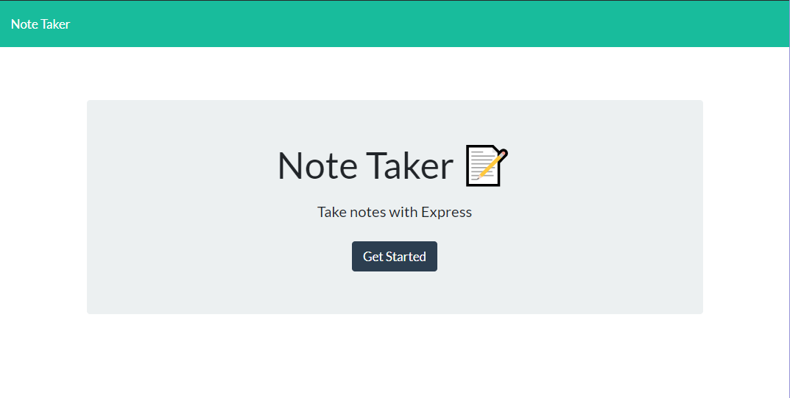
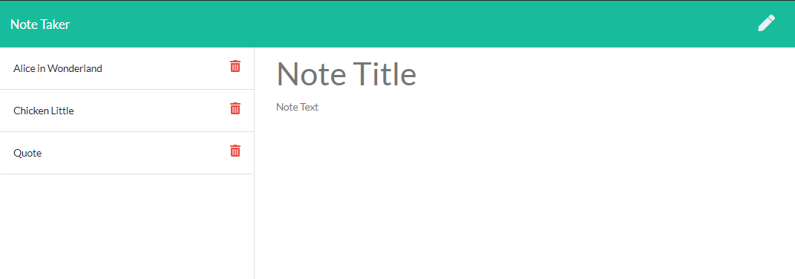
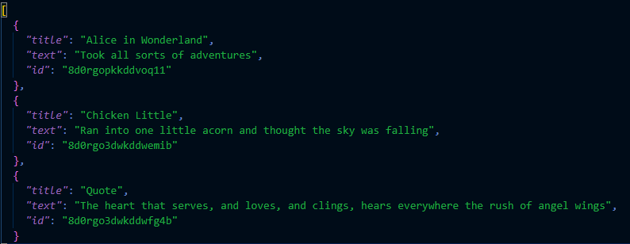

  # Note Taker

  ## Description

  An application used with an Express.js back end to write and save notes, data will be retrieved through a JSON file notes are stored to.

  Deployment Link: [Note Taker App Demo](https://shrouded-everglades-92551.herokuapp.com/)

  ## Table of Contents

  * [Installation](#installation)
  * [Usage](#usage)
  * [License](#license)
  * [Contribution](#contribution)
  * [Questions](#questions) 
  
  ## Installation
  This application is built with HTML, CSS, JavaScript (Node.js, Express.js) and Uniqid NPM Package.
  
  Users need to install the dependencies listed in the package.json first before using this application.

  ## Usage
  After installation, users can navigate to the homepage and click the "Get Started" button to initiate Note Taker. From there, they will be able to enter a note's title and body text through the input sections and click upon the save icon to store it. Note titles will appear on the side bar for review and, in future versions, deletion through the trash icon.

  
  
  
  

  ## License
  This project is covered by the MIT license. 
  
  
  
  ## Contribution
  Contributor Covenant 2.0 available https://www.contributor-covenant.org/

  ## Questions
  Visit my GitHub [Devmadia](https://github.com/Devmadia)

  If you have any additional questions not answered here or wish to contact me regarding developments, please email me at 
  [thedevmadia@gmail.com](mailto:thedevmadia@gmail.com)
  